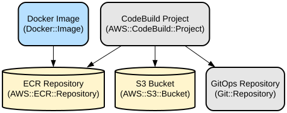

# My Little Recipe Book - A Smart Recipe Management and Recommendation Platform

My Little Recipe Book is a modern web application that helps users discover, manage, and organize recipes while providing personalized recommendations based on user preferences and seasonal ingredients. The platform combines recipe management with smart features like OCR-based ingredient scanning, intelligent search, and a virtual refrigerator management system.

The application is built using Next.js 14 with TypeScript and leverages the NextUI component library for a polished user interface. It features a comprehensive recipe recommendation system that suggests recipes based on user preferences, seasonal ingredients, and YouTube cooking videos. The platform also includes innovative features like OCR-based receipt scanning for automatic ingredient tracking and a smart refrigerator management system that helps users keep track of their ingredients and find matching recipes.

## Repository Structure
```
.
├── app/                      # Next.js application pages and routing
│   ├── auth/                # Authentication-related pages
│   ├── mypage/              # User profile and settings
│   ├── myrefrigerator/      # Virtual refrigerator management
│   ├── recipe/              # Recipe viewing and management
│   └── search/              # Search functionality pages
├── components/              # Reusable React components
│   ├── Auth/               # Authentication components
│   ├── Button/             # Button components
│   ├── Navbar/             # Navigation components
│   ├── Recommend/          # Recipe recommendation components
│   └── Refrigerator/       # Refrigerator management components
├── config/                 # Application configuration
├── providers/             # React context providers
├── styles/               # Global styles and CSS
├── types/                # TypeScript type definitions
└── utils/               # Utility functions and helpers
```

## Usage Instructions
### Prerequisites
- Node.js 18 or higher
- pnpm package manager
- Modern web browser with JavaScript enabled
- Environment variables configured for authentication and API endpoints

### Installation

```bash
# Clone the repository
git clone <repository-url>

# Install dependencies
pnpm install

# Set up environment variables
cp .env.example .env.local
# Edit .env.local with your configuration

# Start development server
pnpm dev
```

### Quick Start
1. Create an account or log in using OAuth providers (Kakao, Naver, or Google)
2. Set up your preferences for recipe recommendations
3. Add ingredients to your virtual refrigerator
4. Explore personalized recipe recommendations
5. Search for recipes using ingredients or keywords

### More Detailed Examples
```typescript
// Adding ingredients to virtual refrigerator
const addIngredient = async (ingredient) => {
  const result = await addToRefrigerator({
    name: ingredient.name,
    expiryDate: ingredient.expiryDate,
    quantity: ingredient.quantity
  });
  return result;
};

// Searching recipes by ingredients
const searchByIngredients = async (ingredients) => {
  const recipes = await searchRecipes({
    ingredients: ingredients,
    excludeIngredients: userPreferences.allergies
  });
  return recipes;
};
```

### Troubleshooting
1. Authentication Issues
   - Error: "Invalid OAuth token"
   - Solution: Clear browser cookies and try logging in again
   - Check if environment variables are properly configured

2. Recipe Search Not Working
   - Verify API endpoint configuration in environment variables
   - Check network connectivity
   - Ensure search parameters are properly formatted

## Data Flow
The application follows a client-server architecture with RESTful API communication for data exchange.

```ascii
User Input → Frontend (Next.js) → API Gateway → Backend Services
     ↑                                              ↓
     └──────────────── Response Data ──────────────┘
```

Key component interactions:
1. User authentication flow through OAuth providers
2. Recipe recommendation engine using user preferences
3. Virtual refrigerator management with real-time updates
4. Search functionality with multiple criteria support
5. OCR processing for receipt scanning
6. Image processing for recipe thumbnails
7. Real-time data synchronization between components

## Infrastructure


The application is containerized using Docker and deployed using AWS services:

- ECR Repository: mylittlerecipebook/mlr-prd-fe-img
- Build Process: AWS CodeBuild with buildspec.yaml
- Deployment: GitOps workflow with automated image updates
- Container Configuration: Multi-stage Dockerfile for optimized builds
- Environment: Production-ready Node.js 18 Alpine-based container

## Deployment
1. Prerequisites:
   - AWS CLI configured with appropriate permissions
   - Docker installed locally
   - Access to ECR repository

2. Deployment Steps:
```bash
# Build Docker image
docker build -t mylittlerecipebook/mlr-prd-fe-img .

# Push to ECR
aws ecr get-login-password --region ap-northeast-2 | docker login --username AWS --password-stdin ${ECR_REGISTRY}
docker push ${ECR_REGISTRY}/mylittlerecipebook/mlr-prd-fe-img:latest
```